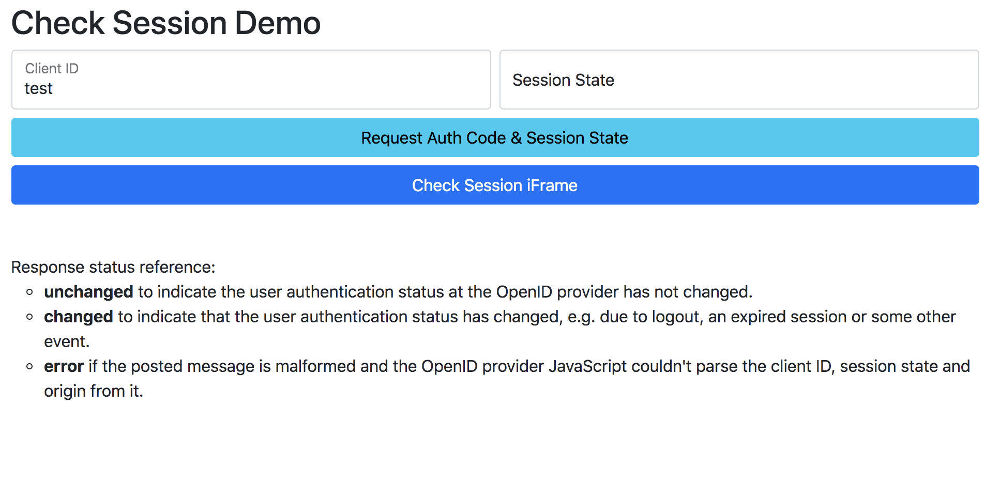

# oidc-check-session-iframe
Simple html page that implements check session flow based on [OpenID Connect Session Management](https://openid.net/specs/openid-connect-session-1_0.html).
1. Relay Party adds a hidden iFrame pointing to OP's ```check_session_iframe```
2. Relay Party iframe polls the OP iframe with postMessage with format ```Client ID + " " + Session State```
3. Relay Party receives the postMessage back from the OP iframe with the session status.

## Configure 

### Adjust OpenID Provider and App settings

Go to the file `index.html` and change the config variables values, for example:

```javascript
 var config = {
        opCheckSessionIframe : "http://localhost:8080/auth/realms/master/protocol/openid-connect/login-status-iframe.html",
        opAuthEndpoint: "http://localhost:8080/auth/realms/master/protocol/openid-connect/auth",
        opOriginDomain : "http://localhost:8080",
        appClientId : "test",
        appRedirectUri : "http://localhost"
    }
```
## Build and run

### Launch the demo application

Just run the `update.sh` script. It will build the app image based on `nginx:alpine` and will expose the app in the port 80.


